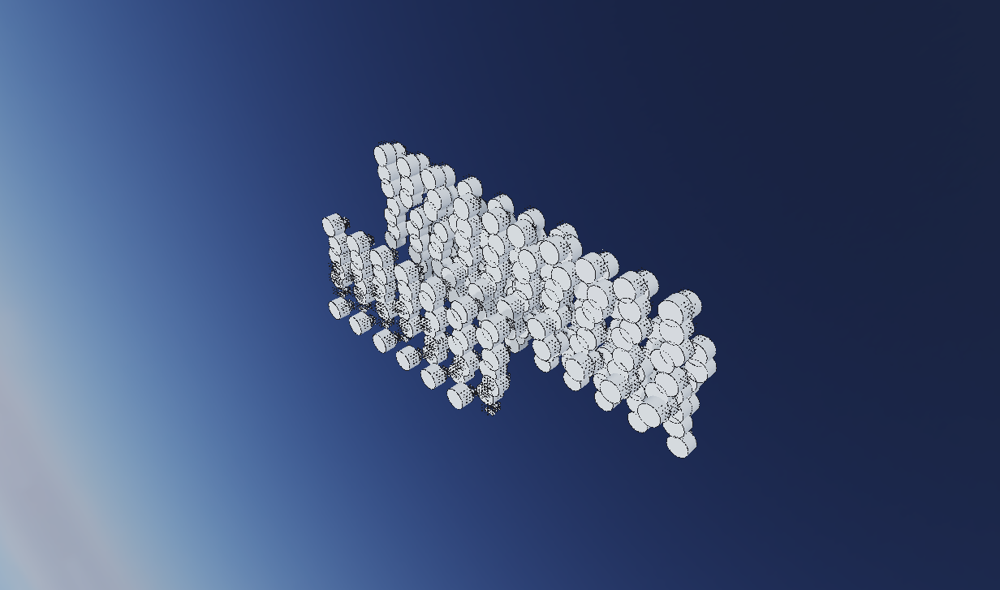

# Large-Assembly Performance Baseline (M34)

Milestone: **M34 — Large-Assembly Performance & Scale** (target: 100k unique parts /
1M total placements). This document records the benchmark, the measured 30k-part
baseline, and the ranked bottleneck roadmap (F1–F7) the numbers justify.



*The committed `auto30k` fixture (29,900 instanced placements over 2,815 unique meshes)
rendered through the production DrawChrome viewport — live visual confirmation that the
assembly loads, flattens, instances, and renders.*

## The benchmark

- **Generator** — `model/benchgen` synthesizes the automotive geometry-weight
  distribution and DAG depth without modeling real parts. Four tiers of extruded n-gon
  prisms (side count = poly weight) placed into a 7-level hierarchy
  (root→system→module→submodule→bay→fastener-kit→fastener) whose dominant flyweight is a
  single shared fastener kit reached through every bay path. Per-tier unique-mesh and
  placement counts are exact (pool size + round-robin), so reuse ratios fall out.
- **Profiles** — `auto30k` (committed) and `auto1m` (the 100k-unique/1M-total goal),
  differing only by config. `oblikovati-cli generate-assembly --profile … --out …`.
- **Pure-Go benchmarks** (`go test -bench`, no cgo) — `BenchmarkCollectPlacedBodies`,
  `BenchmarkVisibleInstances`, `BenchmarkWorldAssemblyBodies`, `BenchmarkBuildBrowser`.
- **Scenario driver** — `head/cmd/perfbench` runs the four spec scenarios (cold load &
  buffer upload, 360° orbit, UI tree build, parametric propagation) against the real
  viewport, emitting JSON + per-scenario `perf/benchprof` memory/GC and (with
  `OBK_PPROF_DIR`) CPU+heap profiles.

### auto30k realized shape

| Tier | Placements | Unique meshes | Reuse |
|---|---|---|---|
| Fasteners | 22,400 | 15 | ~1493× |
| Brackets | 5,000 | 1,000 | 5× |
| Machined | 2,200 | 1,500 | ~1.5× |
| Systems | 300 | 300 | 1× |
| **Total** | **29,900** | **2,815** | — |

Depth 7; 427 sub-assemblies; 3,242 documents (~51 MB on disk). In-memory generation:
~0.5 s, heap 318 MB, peak RSS 415 MB — **memory scales with the 2,815 unique meshes, not
the 29,900 placements** (the flyweight claim, confirmed).

## Measured 30k baseline

> Host: this dev machine, Go 1.26, **Vulkan via lavapipe (software rasterizer)**. The
> orbit/first-frame *wall times* are therefore NOT GPU-representative — treat them as an
> upper bound. The **allocation, GC, and CPU-attribution figures are hardware-independent**
> and are the actionable signal.

### Pure-Go per-call cost (every-frame hot paths)

| Benchmark | Time/op | Alloc/op | Allocs/op |
|---|---|---|---|
| CollectPlacedBodies (flatten) | 6.3 ms | 31 MB | 62k |
| VisibleInstances (render scene) | 8.7 ms | 44 MB | 69k |
| BuildBrowser (model tree) | 1.0 ms | 5 MB | 4.5k |
| **WorldAssemblyBodies (picking, pre-F5)** | **1.54 s** | **2.03 GB** | **31.7M** |
| **RayPickBodies (picking, post-F5)** | **18.5 µs** | **362 B** | **7** |

### Scenario driver (auto30k, lavapipe)

| Scenario | Result |
|---|---|
| Cold load | ~0.47 s build, first frame ~4.3 s, peak RSS ~446 MB |
| Orbit | ~690 ms/frame*, **725 MB allocated per frame** |
| UI stress | 1.1 ms/build, 4.8 MB/build |
| Propagation | ~10–23 ms re-flatten, 42 MB |

\* software raster; CPU profile shows **~47% of orbit time in GC** (`runtime.gcDrain`),
driven by the per-frame allocation churn — not GPU submission.

### pprof attribution (orbit, `alloc_space`)

| Allocator | Share |
|---|---|
| `head/ui.instanceBuilder.appendStream` | **53%** — the merged instanced frame mesh is rebuilt from scratch every frame |
| `topo.Body.Edges` / `topo.Face.Edges` | ~28% — edges re-derived per frame (range box, drawlist) |
| `compdef.placeOccurrence` (flatten) | ~7% |
| `app.assemblyInstances` | ~5% |

## Ranked bottlenecks → roadmap

1. **F5 — spatial-index picking (#1204). ✅ RESOLVED.** `worldAssemblyBodies` rebuilt every
   occurrence's geometry via `ops.TransformBody`: **2.03 GB / 1.54 s / 31.7M allocs for a
   single selection at 30k** — unusable, impossible at 1M. Fixed by a BVH over placement world
   AABBs (`app/pick_index.go`): a pick ray now visits O(log N + hits) boxes and materializes
   only the placements it actually crosses. The same selection is now **362 B / 18.5 µs / 7
   allocs** — a ~5.6-million× drop in allocation and ~83,000× in time. Picking was the highest
   severity (it blocked basic interaction); it is now the cheapest hot path.
2. **F1 — per-instance frustum culling (#1200). ✅ RESOLVED.** The instanced path emitted a
   matrix + draw for every placement every frame regardless of view. Fixed with a frustum
   broad phase over the F5 placement BVH (`scene.Frustum` + `Session.CulledInstances`): a
   zoomed corner view of the 30k car now reaches the GPU with **19 of 29,900 transforms**, and
   the culled query is 9.4 µs / 4.4 KB vs `VisibleInstances`' 10.75 ms / 44 MB (it reuses the
   cached index instead of re-flattening). This is the win for zoomed views and the 1M target.
   **Still open (separate from culling):** at a *full-frame* orbit everything is in view, so the
   53%-of-allocation `instanceBuilder.appendStream` rebuild of the merged frame mesh remains —
   tracked as **F1b retain/dirty-flag the merged frame mesh (#1210)**. ~725 MB/frame today.
3. **F2 — parallel + GC-trimmed transform traversal (#1201). ✅ RESOLVED.** `collectPlacedBodies`
   was 31 MB / 62k allocs / 6.3 ms every flatten (render + propagation both pay it),
   single-threaded, with a fresh `OccurrencePath` allocated per node. Rewritten to walk with a
   reused DFS path stack (one path copy per emitted leaf — **allocs halved to ~30k**) and to fan
   the top-level subtrees across workers (**6.3 ms → 3.48 ms, ~1.8×**), output byte-identical to
   the serial walk (race-clean equality test). A *body cache keyed by revision was rejected*: the
   occurrence revision does not capture a child part's geometry edit, and `PlacedBodies` must read
   live child bodies — caching them would return stale geometry. The remaining `topo.*.Edges`
   re-derivation (~28% of orbit alloc, a render-path cost on the immutable kernel body, not the
   flatten) is split out as **F2b cache body edge/face derivation (#1212). ✅ RESOLVED**: the
   distinct face/edge/vertex lists are now precomputed once at body finalization (immutable
   topology) and returned from cache — per-query 6 allocs/223 ns → 1 alloc/21 ns, full-frame 30k
   orbit allocation 738 MB → 603 MB.
4. **F4 — Vulkan frames-in-flight + DEVICE_LOCAL geometry (#1203).** Not isolable on
   lavapipe, but the architecture (per-frame full stall + per-frame HOST_VISIBLE
   re-upload of the whole scene) is the next wall on real GPUs once F1/F2 cut the CPU
   churn; first-frame upload is already multi-second.
5. **F3 — virtualized browser tree (#1202).** Lower than first expected:
   `BuildBrowser` is only 4.8 MB / 1.1 ms at 30k. The real cost is the `drawNode` cgo
   walk (every node, every frame), which `OBK_FRAME_TIMING`'s new `browserNs` phase now
   measures in-app — re-rank after an in-app capture with the tree expanded.
6. **F6 — DAG cycle/depth guard (#1205). ✅ RESOLVED.** The flatten now tracks the sub-assembly
   definitions on the current branch (cycle set) and caps recursion at `maxAssemblyDepth` (256), so
   a self-containing or pathologically deep occurrence DAG degrades to a bounded, finite flatten
   instead of overflowing the stack. No measurable overhead (guard touches only interior nodes).
7. **F7 — LOD / impostors (#1206).** The vertex-throughput wall at true 1M, after F1–F5.

## Reproduce

```sh
# fixture (or pass --save=false to measure generation only)
go run ./cmd/oblikovati-cli generate-assembly --profile auto30k --out /tmp/car30k

# pure-Go benches
go test -bench 'CollectPlacedBodies' -benchmem ./model/compdef/
go test -bench 'VisibleInstances|BuildBrowser' -benchmem ./app/
go test -bench 'WorldAssemblyBodies|RayPickBodies' -benchmem -benchtime=3x ./app/  # F5 before/after

# scenario driver + profiles (offscreen; lavapipe in headless envs)
export VK_ICD_FILENAMES=/usr/share/vulkan/icd.d/lvp_icd.json OBK_PPROF_DIR=/tmp/prof
go run ./head/cmd/perfbench -profile auto30k -out /tmp/perf30k.json -png /tmp/car30k.png
go tool pprof -top -sample_index=alloc_space /tmp/prof/orbit.heap.pprof
```
